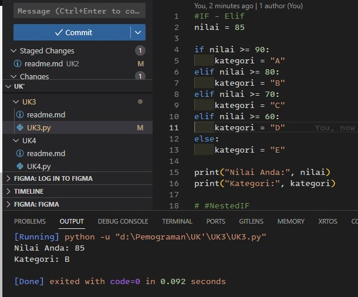
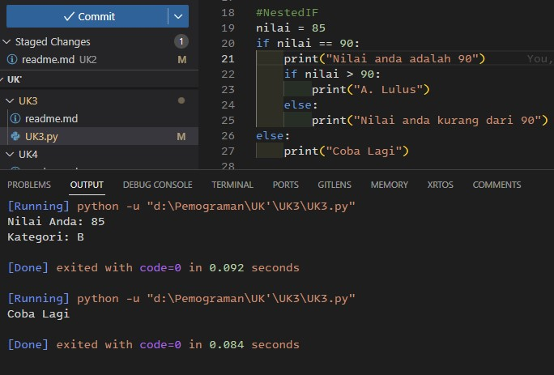
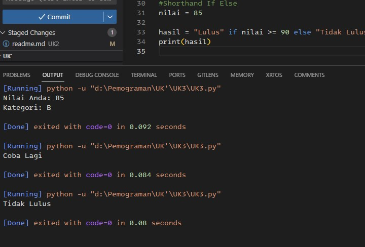
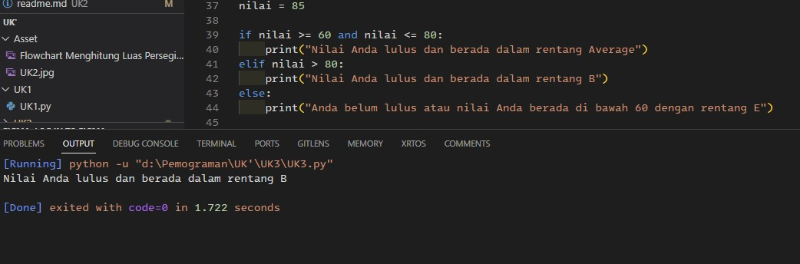
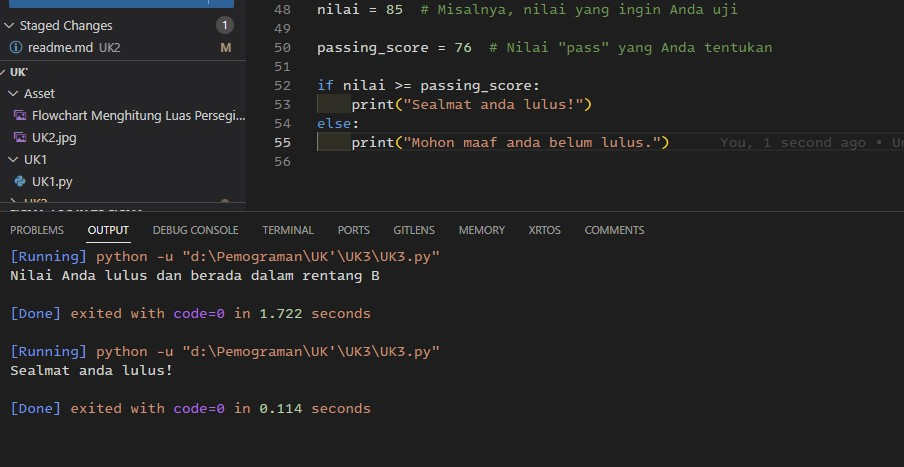
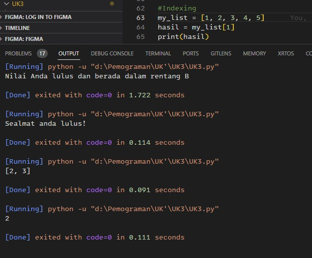
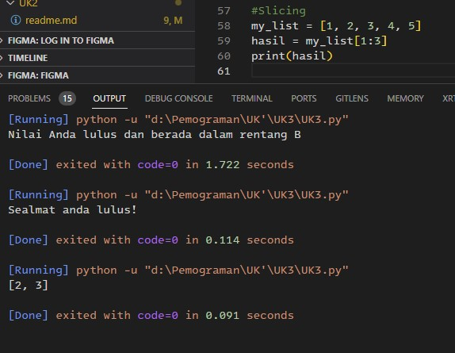

# 1
> IF - Elif -> Untuk membuat pilihan berdasarkan beberapa kondisi tertentu.

> NestedIF -> Untuk membuat pilihan berdasarkan beberapa kondisi tertentu tetapi lebih menguji kondisi yang lebih dalam.

> Shorthand If Else -> Untuk membuat pilihan berdasarkan beberapa kondisi tertentu dalam satu baris kode.

> IF Multiconditional Untuk membuat pilihan berdasarkan beberapa kondisi tertentu secara bersamaan. 

> IF Pass -> adalah sebuah statetment yang tidak melakukan apa apa

# 2
1. For digunakan untuk melakukan perulangan yang bersifat definite iteration

2. Do While digunakan untuk melakukan perulangan terlebih dahulu lalu memeriksa kondisi atau syaratnya

# 3
1. Indexing digunakan untuk mengetahui posisi elemen pada list

1. Slicing digunakan untuk mendapatkan bagian dari suatu list atau array
