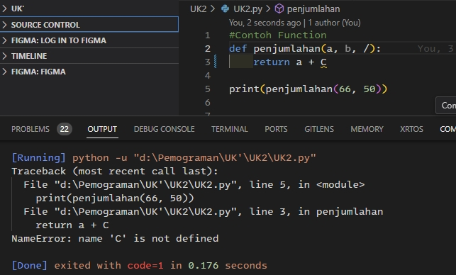
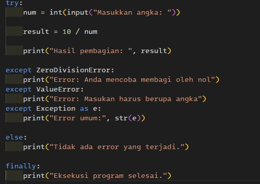

1. Kondisi dimana sebuah progam mengalami crash atau progam tidak berjalan. Contoh error pada progam : 
- Runtime Error,
- Logical Error,
- Syntax Error,
- Compilation Error.

- 

2. Mekanisme yang diperlukan untuk menangani error saat progam di eksekusi / dijaklankan.

3. Proses menemukan dan memperbaiki kesalahan awakutu di kode progam