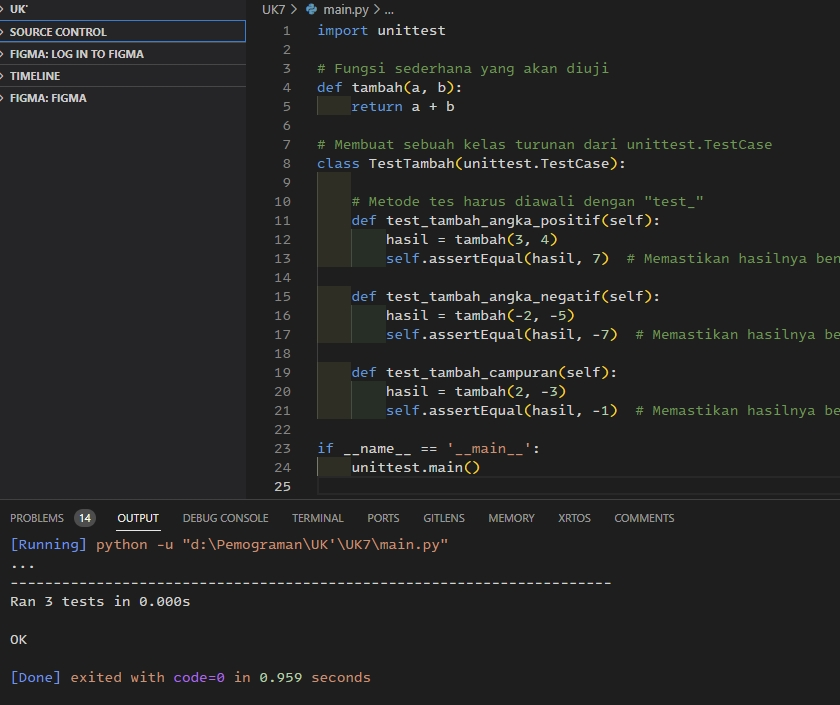

1.sekumpulan module yang dirancang untuk pengujian.

2. - Unit Test sekumpulan module yang dirancang untuk pengujian.
   - Integration Test menguji unit-unit tersebut bekerja dalam satu kesatuan.
   - End to End Test testing yang menyamakan user behaviour dengan aplikasi dengan environment yang sama seperti production.
